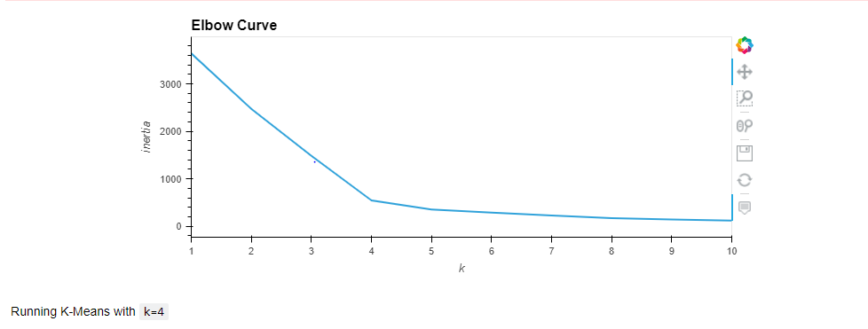
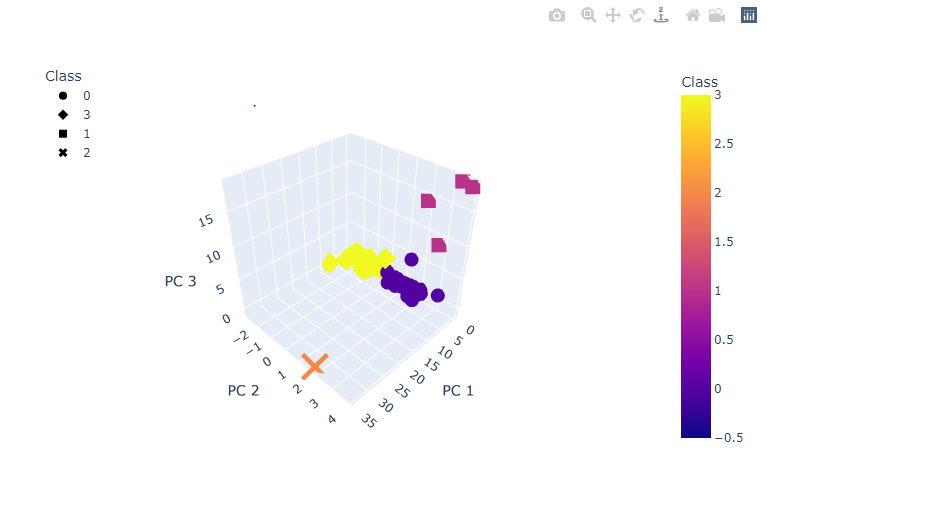
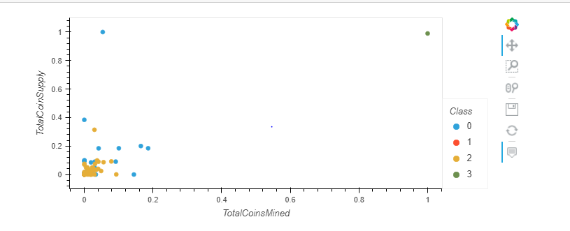
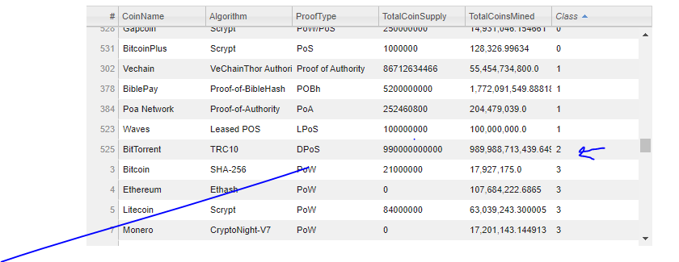

## Overview

in this project we use unsupervised machine learning to analyze a database of crypto currencies and the classify them according to their features. The end use case is for the bank to propose a new cryptocurrency  based investment portfolio to its potential clients.

Our analysis includes the following steps:

1. Preprocessing the Data for PCA (Principal Component Analysis)
2. Then reducing the data using PCA
3. Then using K-means for clustering the crypto currencies
4. And finally visualizing the cryptocurrencies results.

## Results 

 

| **Clustering the Crypto  currencies using K-Means**          |      |
| ------------------------------------------------------------ | ---- |
|  |      |
| K-means clustering is used in  unsupervised learning where data does not exist in defined categories or  groups. The goal of this algorithm is to find groups in the data. The number  is represented by K which in this case is 4. |      |
|                                                              |      |
| **Visualizing the Results**                                  |      |
|  |      |
| Three D Scatter Plot with the dimensions  reduced to the three principal components |      |
|                                                              |      |
| **HVPLOT based scatter plot**                                |      |
|  |      |
| The scatter plot using the two principal  components TotalCoinSupply and TotalCoinsMined |      |
|                                                              |      |
| **Tradabale CryptoCurrencies**                               |      |
|  |      |
| BitTorrent is the only cryptocurrency  in class 2. The others are mostly in class 0 or 1. |      |
|                                                              |      |
|                                                              |      |
| **Summary**                                                  |      |
|                                                              |      |
| 532 cryptocurrencies were  identified based on the similarity of their features. This serves as a good  analysis for the investment bank. |      |
